  

java · minecraft · networking

  

## projects

**NovaSpigot**
PandaSpigot-based Minecraft server fork focused on server infrastructure and networking.

`Java` `Netty` `Gradle` `Minecraft 1.8.x`

**NovaBound**
Custom Minecraft 1.8.9 client project.

`Java` `MCP` `Minecraft 1.8.9`

 

`building systems, not just projects.`

  

  

averagekxr · 2026

